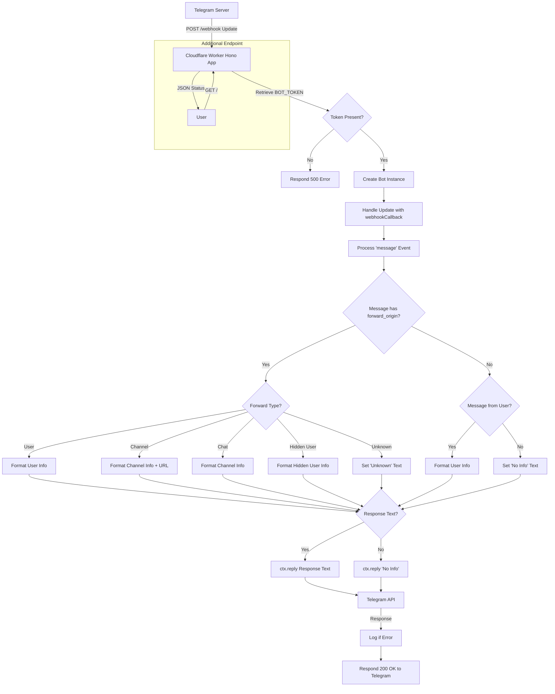

# Telegram UserInfo Bot

A Telegram bot that extracts and displays detailed user information from forwarded messages or direct interactions. Built with Hono framework and grammY library, designed for deployment on Cloudflare Workers.

## ✨ Features

- 👤 **User Information Extraction**: Get detailed user info from any message
- 📨 **Forward Message Analysis**: Extract original sender info from forwarded messages  
- 🔗 **Channel Link Generation**: Generate direct links to channel messages
- 👻 **Hidden User Detection**: Handle anonymous forwarded messages
- 🚀 **Serverless Deployment**: Optimized for Cloudflare Workers
- 📱 **Clean Response Format**: Organized and readable user information display

## 🏗️ Architecture



## 📋 Information Types Handled

### Regular Messages
- Username (@username)
- User ID
- First Name
- Last Name (if available)
- Language Code (if available)

### Forwarded Messages
- **From User**: Original sender's complete information
- **From Channel**: Channel name, ID, title, and direct message link
- **From Chat**: Chat information including title and ID
- **Hidden User**: Anonymous sender name and forward date

## 🛠️ Tech Stack

- **Framework**: [Hono](https://hono.dev/) - Fast, lightweight web framework
- **Bot Library**: [grammY](https://grammy.dev/) - Modern Telegram Bot API framework
- **Runtime**: Cloudflare Workers
- **Language**: TypeScript
- **Deployment**: Serverless

## 📁 Project Structure

```
telegram-userinfo-bot/
├── src/
│   └── index.ts          # Main bot logic and handlers
├── wrangler.toml         # Cloudflare Workers configuration
├── package.json          # Dependencies and scripts
├── tsconfig.json         # TypeScript configuration
└── README.md            # Project documentation
```

## 🚀 Quick Start

### Prerequisites

- Telegram Bot Token from [@BotFather](https://t.me/botfather)
- Cloudflare Workers account

### Installation

```bash
git clone https://github.com/yourusername/telegram-userinfo-bot.git
cd telegram-userinfo-bot

# Install dependencies
pnpm install

# Start the development server
pnpm run dev

# deploy the project
pnpm run deploy
```

## ⚙️ Configuration

### Environment Variables

| Variable | Description | Required |
|----------|-------------|----------|
| `BOT_TOKEN` | Telegram Bot Token from BotFather | ✅ |

### Cloudflare Workers Setup

1. Create a new Worker in your Cloudflare dashboard
2. Set the `BOT_TOKEN` secret using Wrangler CLI
3. Configure webhook URL: `https://your-worker.your-subdomain.workers.dev/webhook`

### Webhook Configuration

Set your bot's webhook URL using Telegram Bot API:

```bash
curl -X POST "https://api.telegram.org/bot<YOUR_BOT_TOKEN>/setWebhook" \
     -H "Content-Type: application/json" \
     -d '{"url": "https://your-worker.your-subdomain.workers.dev/webhook"}'
```

## 📖 Usage

### Basic Usage

1. **Start a chat with your bot**
2. **Send any message** to get your user information
3. **Forward any message** to get the original sender's information

### Message Types Supported

#### Direct Messages
```
@username
Id: 123456789
First: John
Last: Doe
Lang: en
```

#### Forwarded from User
```
@originaluser
Id: 987654321
First: Jane
Last: Smith
Lang: es
```

#### Forwarded from Channel
```
@channelname
Id: -1001234567890
Title: Example Channel
https://t.me/channelname/123
```

#### Hidden User Forward
```
Hidden User: Anonymous User
Date: 12/25/2023, 10:30:00 AM
```

## 🔧 API Endpoints

### Webhook Endpoint
- **URL**: `/webhook`
- **Method**: `POST`
- **Description**: Receives updates from Telegram Bot API

### Health Check
- **URL**: `/`
- **Method**: `GET` 
- **Response**:
```json
{
  "status": "ok",
  "platform": "cloudflare-workers",
  "version": "1.0.0",
  "message": "UserInfo Telegram Bot",
  "description": "Forward any message to get user info",
  "timestamp": "2025-08-15T10:02:42.342Z"
}
```

## 📜 License

[MIT](./LICENSE) License &copy; 2025-PRESENT [wudi](https://github.com/WuChenDi)
